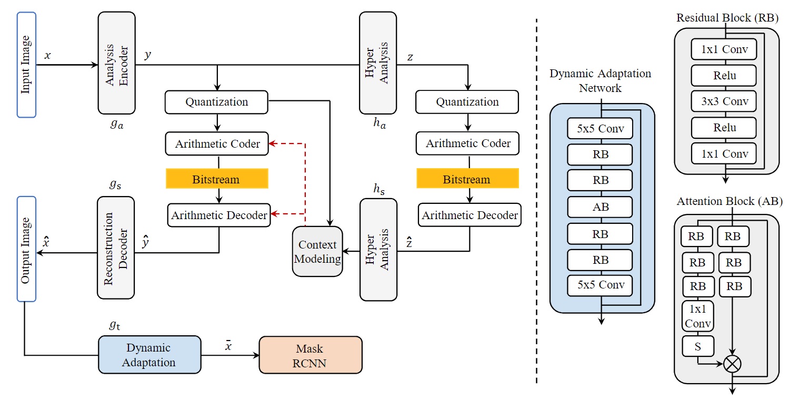
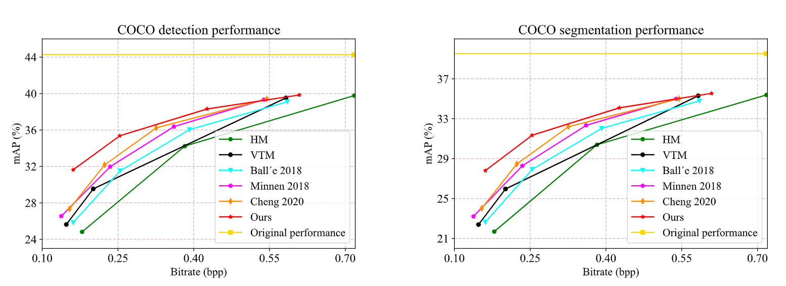

# Compression_ICIP_2024
Recent advancements in neural image compression have shown great potential in outperforming conventional standard codecs in terms of both rate-distortion and rate-analysis performance. However, there is an issue of divergent preferences in information preservation or reconstruction in the process of compression for humans and machines, respectively. Compression for humans tends to retain the signal fidelity or perceptual quality of visual appearance while compression for machines requires preserving critical semantic information, resulting in the limitation of the bitstream supporting only a single requirement during the compression. To bridge this gap, we propose a dynamic adaptation approach that generates a single bitstream serving both humans and machines. This approach aims to mitigate the domain gap among tasks, which facilitates maintaining the performance of out-of-scope tasks. Specifically, the proposed method concentrates on learning a dynamic adaptation process, i.e., optimizing the latent representation in the compressed domain in an end-to-end manner while adhering to the rate-performance constraint. Extensive results reveal that our paradigm significantly reduces the domain gap, surpassing existing codecs.

# [ICIP'24] 
Official Pytorch implementation of **Learned Image Compression for Both Humans and Machines via Dynamic Adaptation**.

[Lingyu Zhu](https://scholar.google.com/citations?user=IhyTEDkAAAAJ&hl=zh-CN),
[Binzhe Li](),
[Riyu Lu](), 
[Peilin Chen](),
[Qi Mao](https://scholar.google.com/citations?user=VTQZF6EAAAAJ&hl=zh-CN),
[Zhao Wang](),
[Wenhan Yang](https://scholar.google.com/citations?user=S8nAnakAAAAJ&hl=zh-CN),
[Shiqi Wang](https://scholar.google.com/citations?user=Pr7s2VUAAAAJ&hl=zh-CN)


## Overview
<p align="left">

</p>

## Abstract
Recent advancements in neural image compression have shown great potential in outperforming conventional standard codecs in terms of both rate-distortion and rate-analysis performance. However, there is an issue of divergent preferences in information preservation or reconstruction in the process of compression for humans and machines, respectively. Compression for humans tends to retain the signal fidelity or perceptual quality of visual appearance while compression for machines requires preserving critical semantic information, resulting in the limitation of the bitstream supporting only a single requirement during the compression. To bridge this gap, we propose a dynamic adaptation approach that generates a single bitstream serving both humans and machines. This approach aims to mitigate the domain gap among tasks, which facilitates maintaining the performance of out-of-scope tasks. Specifically, the proposed method con- centrates on learning a dynamic adaptation process, i.e., optimizing the latent representation in the compressed domain in an end-to-end manner while adhering to the rate-performance constraint. Extensive results reveal that our paradigm significantly reduces the domain gap, surpassing existing codecs


## Quantitative Performance
<p align="left">

</p>


## Public Dataset

We use the RGB image based on the [COCO 2017](https://cocodataset.org/#home) dataset.


## Citation Information
If you find the project useful, please cite:
```
@article{,
  title={Learned Image Compression for Both Humans and Machines via Dynamic Adaptation},
  author={Lingyu Zhu, Binzhe Li, Riyu Lu, Peilin Chen, Qi Mao, Zhao Wang, Wenhan Yang, Shiqi Wang},
  journal={IEEE International Conference on Image Processing},
  year={2024}
}
```


